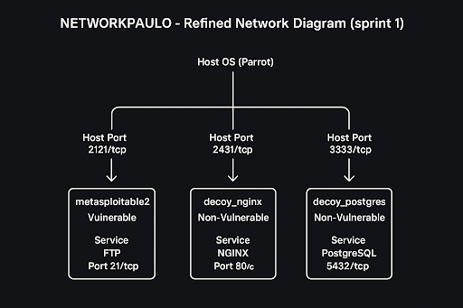

# Red-Team-VS-Blue-Team
Designed and deployed a segmented lab environment using Parrot OS and Metasploitable configuring two decoy services and one intentionally vulnerable service to simulate a threat landscape. Operations using Nmap for network reconnaissance and service enumeration, identifying open ports and potential attack points across the simulated envir# Red-Team-VS-Blue-Team

## Overview

This project is a containerized Red Team vs Blue Team deception environment built using Podman and Podman Compose on Parrot OS. The lab simulates a segmented network containing one intentionally vulnerable target alongside multiple decoy services designed to influence attacker reconnaissance behavior and generate observable attack traffic.

The environment was developed to explore:
- Offensive security methodologies
- Reconnaissance behavior
- Service enumeration
- Vulnerability exploitation
- Deception strategies
- Blue Team detection opportunities

The project combines practical penetration testing with containerized infrastructure to simulate realistic attack paths in an isolated environment.

---

# Project Goals

The objectives of this environment are to:

- Simulate a realistic attack surface using containerized services
- Study how attackers prioritize targets during reconnaissance
- Deploy intentional decoy services to influence attacker behavior
- Practice exploitation techniques safely within an isolated lab
- Analyze attacker enumeration strategies
- Prepare for future logging and detection integrations

---

# Technologies Used

- Podman
- Podman Compose
- Parrot OS
- Metasploitable2
- NGINX
- PostgreSQL
- Nmap
- Metasploit Framework
- Netcat
- GitLab

---

# Architecture

## Custom Podman Network

- **Network Name:** `NETWORKPAULO`
- **Driver:** Bridge

## Services

| Container | Image | Service | Host Port | Container Port |
|---|---|---|---|---|
| metasploitable2 | tleemc2/metasploitable2 | FTP | 2121 | 21 |
| decoy_nginx | nginx:stable-alpine | HTTP | 2431 | 80 |
| decoy_postgres | postgres:15 | PostgreSQL | 3333 | 5432 |

---

# Network Diagram

```md

```

---

# Deployment

## Start the Environment

```bash
cd compose
podman-compose up -d
```

---

## Verify Running Containers

```bash
podman ps
```

Expected exposed services:
- FTP → `localhost:2121`
- HTTP → `localhost:2431`
- PostgreSQL → `localhost:3333`

---

# Verification Commands

## Nmap Scan

```bash
nmap -p 2121,2431,3333 localhost
```

## Verify NGINX

```bash
curl http://localhost:2431
```

## Verify FTP Service

```bash
nc -v localhost 2121
```

## Verify PostgreSQL

```bash
nc -vz localhost 3333
```

---

# Reconnaissance and Deception Strategy

The environment intentionally exposes one vulnerable service alongside multiple decoy services to influence attacker reconnaissance priorities.

The vulnerable service provides a realistic exploitation path, while the decoys are intended to:
- Increase reconnaissance complexity
- Slow attacker decision-making
- Generate observable scan traffic
- Divert attention away from legitimate targets

Distinct host-to-container port mappings also improve visibility into attacker behavior and simplify monitoring during scans and exploitation attempts.

---

# Penetration Test Summary

A penetration test was conducted against a vulnerable GitLab service running behind an NGINX reverse proxy. The assessment focused on reconnaissance, service fingerprinting, vulnerability analysis, and exploitation.

The environment contained both legitimate vulnerable targets and intentional decoy services designed to complicate enumeration.

---

## Executive Summary

The penetration test successfully identified and exploited a vulnerable GitLab service using CVE-2021-22205, a remote code execution vulnerability involving malicious image uploads through ExifTool processing.

Successful exploitation resulted in root-level access to the target container, demonstrating the severe impact of outdated and improperly secured services.

The assessment also highlighted how decoy services influence attacker reconnaissance behavior by requiring additional analysis to distinguish legitimate services from deceptive targets.

---

# Detailed Findings

## Finding 1 — Remote Code Execution via GitLab (CVE-2021-22205)

### Risk Rating
**CRITICAL**

### Description

A GitLab service running behind NGINX on TCP port 8080 was identified as vulnerable to CVE-2021-22205.

The vulnerability exists due to improper handling of metadata during image uploads using ExifTool. Attackers can craft malicious image payloads capable of executing arbitrary system commands remotely.

### Affected Service

| IP Address | Port | Service |
|---|---|---|
| 192.168.0.200 | 8080/tcp | GitLab (NGINX) |

---

### Attack Path

1. Nmap scanning identified open ports and running services
2. Service fingerprinting revealed GitLab behind NGINX
3. Public CVE research identified CVE-2021-22205
4. Metasploit Framework successfully exploited the vulnerability
5. Remote root-level access was achieved

---

### Evidence

Example reconnaissance command:

```bash
nmap -sV 192.168.0.200
```

Example Metasploit workflow:

```bash
msfconsole
search gitlab
use exploit/multi/http/gitlab_exif_rce
```

---

# Ethical Use Notice

This environment is intended strictly for educational and authorized security testing purposes within isolated lab environments.

Do not expose intentionally vulnerable services to the public internet.

---

# Author

Paulo McKone

GitHub Repository:
https://github.com/pmckone/Red-Team-VS-Blue-Team
onment
